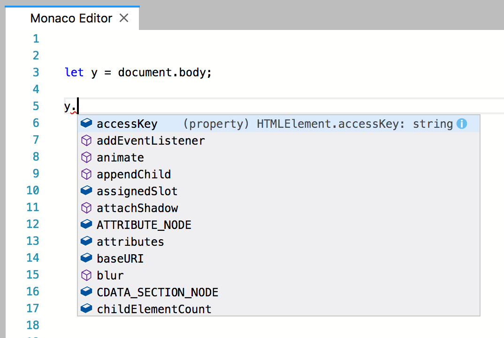
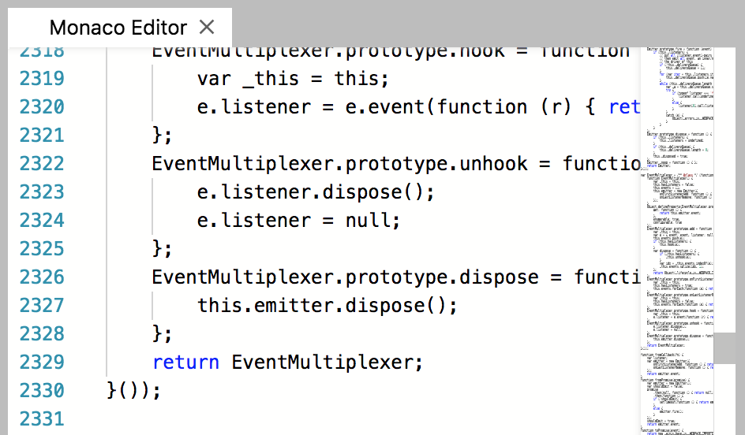

# JupyterLab Monaco Editor Extension

A JupyterLab extension providing the [Monaco](https://github.com/Microsoft/monaco-editor/) editor.

The current state of this extension is merely a 'proof-of-concept' implementation and nowhere near production status. All functionality and interaction with the 'abstract editor interface' that JupyterLab provides is still missing.

Also, the Codemirror themes, Codemirror syntax highlighting and Codemirror keymaps won't work with Monaco. That would have to be managed separately.

As for the VS Code extensions: Monaco is the editor that powers VS Code. Or to put it otherwise: Monaco is merely a part of the whole VS Code application, packaged to work on the web (limited capabilities compared to desktop). An extension for VS Code therefore is not guaranteed to work on Monaco, as it probably uses a whole lot more of VS Code than merely the Monaco parts. The other way around is much more probable.

Feel free to head over to Monaco's repo and website to see what is and isn't possible. Their [FAQ](https://github.com/Microsoft/monaco-editor#faq) explains a lot.

|  |  |
| ----------------------------------------------- | ------------------------------------- |

## Prerequisites

* JupyterLab 0.32

## Development

For a development install, do the following in the repository directory:

```bash
yarn install
yarn run build
jupyter labextension link .
```

To rebuild the package and the JupyterLab app:

```bash
yarn run build
jupyter lab build
```

If you have an node error like `FATAL ERROR: CALL_AND_RETRY_LAST Allocation failed - JavaScript heap out of memory`, you can increase the memory available to node by creating an environment variable:

```sh
export NODE_OPTIONS=--max-old-space-size=4096
```

## Development notes

The tricky thing about this repo is that we webpack up Monaco as part of the build process and publish those JavaScript files as part of the package. Because Monaco likes to use web workers to start up parts of the application, we must have standalone js files and a way to get the URL for those files in the final JupyterLab build. We get the URL in the extension by using the webpack file loader (triggered by prefixing an import with `file-loader!`) in the final JupyterLab build for the Monaco js files. Since we depend on the webpack file-loader npm package, we know that the JupyterLab build will have that loader available.

